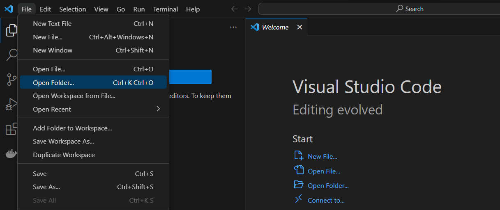
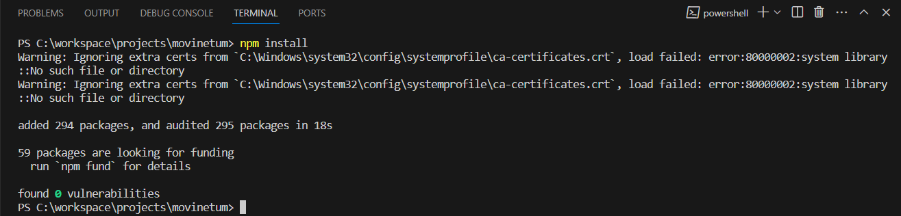
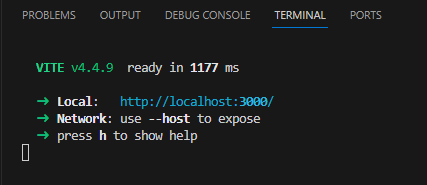

# Movinetum

## Installation de l'environnement de développement

Il faut avoir installé les outils suivants :
- [Node.js version 20 (LTS) ou 22](https://nodejs.org/fr). Il s'agit d'un environnement d'exécution JavaScript, qui nous sert à compiler et lancer l'application sur notre machine.
- [Visual Studio Code](https://code.visualstudio.com/). C'est l'outil de développement que nous utilisons pour écrire le code de l'application.

Une fois ces outils installés, ouvrir le logiciel "Visual Studio Code", et aller ouvrir le dossier du projet ("File/Open Folder").



Au premier démarrage, il faut installer les "dépendances" du projet, c'est à dire des "briques" toutes faites, fournies par la communauté des développeurs, qui vont nous permettre de construire notre application, à la manière de LEGO®. Pour cela, il faut ouvrir un "Terminal" en cliquant dans le menu "Terminal/New Terminal", et taper la commande suivante :

```bash
npm install
```



NOTE: Pour valider une commande, il faut appuyer sur la touche "Entrée" du clavier.

Il faut également copier le fichier .env.local.example en .env.local et remplir le fichier avec les bonnes informations. Merci de demander aux collègues pour les informations à remplir.

## Lancer l'application
Dans ce terminal, il faut taper la commande suivante :

```bash
npm run dev
```

Lorsque l'application est prête, un message s'affiche dans le terminal, comme sur l'image ci-dessous:



Ouvrir un navigateur web, et aller à l'adresse indiquée dans le terminal (http://localhost:3000/). L'application s'affiche.

NOTE: Pour arrêter l'application, il faut appuyer sur les touches "Ctrl" et "C" du clavier.